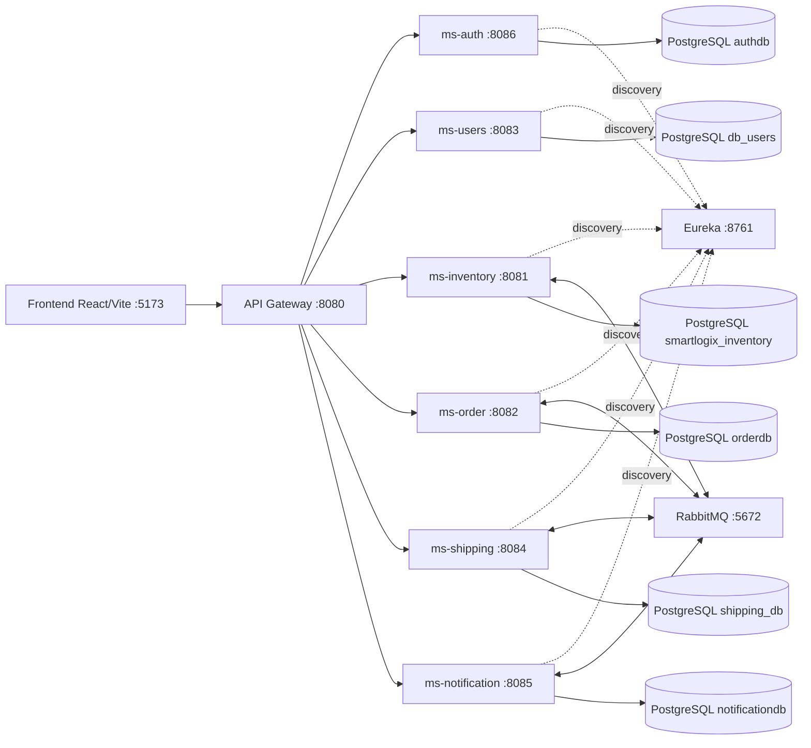

# Arquitectura SmartLogix

SmartLogix usa microservicios Spring Boot 3.2.5 con Java 21. El frontend React/Vite consume solo el API Gateway. Los servicios se registran en Eureka y se integran por REST y eventos RabbitMQ.

Patrones aplicados:

- Repository Pattern: cada servicio aisla persistencia mediante Spring Data JPA repositories.
- DTO/Mapper: controllers exponen DTOs y delegan conversiones a mappers, incluyendo MapStruct en inventory, order, shipping y users.
- API Gateway: centraliza entrada HTTP, rutas, CORS, Swagger agregado y validacion JWT.
- Database per Service: cada microservicio tiene PostgreSQL propio para bajo acoplamiento.
- Saga/Coreografia: order publica eventos, inventory reserva stock, shipping crea envios/rutas y notification informa cambios.
- Circuit Breaker: shipping y notification incluyen Resilience4j para dependencias externas.
- Strategy: shipping define estrategias de calculo de carrier (`LocalCarrierStrategy`, `DhlStrategy`).
- Soft Delete: donde aplica, el borrado se modela como cambio de estado, por ejemplo shipments cancelados.
