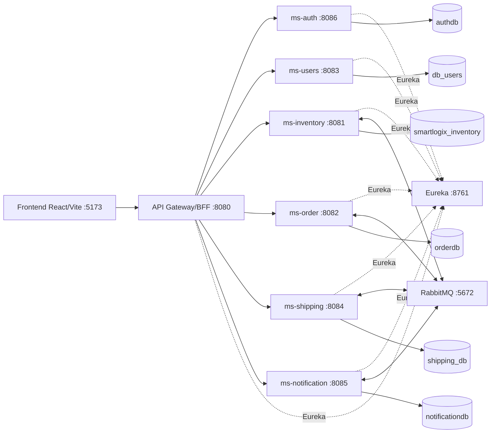

# Arquitectura SmartLogix

SmartLogix implementa una arquitectura de microservicios para una plataforma logistica fullstack. El frontend React/Vite consume exclusivamente el API Gateway/BFF; los microservicios se registran en Eureka y se integran por REST y eventos RabbitMQ.

## Componentes

| Componente | Ruta | Puerto | Responsabilidad |
|---|---|---:|---|
| Frontend | `Frontend/smartlogix-app` | 5173 | Interfaz React/Vite/TypeScript |
| API Gateway/BFF | `Backend/api-gateway` | 8080 | Entrada unica, CORS, JWT, routing, Swagger agregado |
| Eureka | `Backend/eureka-server` | 8761 | Service discovery |
| ms-auth | `Backend/auth` | 8086 | Registro, login y emision de JWT |
| ms-users | `Backend/users` | 8083 | Empresas, perfiles, roles, carriers e integraciones |
| ms-inventory | `Backend/inventory` | 8081 | Productos, bodegas, stock, movimientos y reservas |
| ms-order | `Backend/order` | 8082 | Ordenes, items y catalogo geografico |
| ms-shipping | `Backend/shipping` | 8084 | Envios, rutas, tracking y estrategia de carrier |
| ms-notification | `Backend/notification` | 8085 | Notificaciones in-app, email y listeners RabbitMQ |

## Diagrama de arquitectura

Fuente Mermaid: `docs/diagrams/arquitectura-microservicios.mmd`.

## BFF/API Gateway

El componente `Backend/api-gateway` cumple el rol de BFF/API Gateway para la entrega:

- Es la unica URL backend consumida por el frontend.
- Expone rutas `/smartlogix/**`.
- Valida JWT en rutas protegidas.
- Propaga `X-Company-Id` al microservicio destino.
- Centraliza CORS.
- Agrega Swagger/OpenAPI de microservicios.

No es un BFF orquestador complejo de vistas; es un Gateway con funciones BFF suficientes para entrada unica, seguridad y contratos REST. Esta decision debe explicarse en defensa oral.

## Integracion

| Tipo | Evidencia |
|---|---|
| Frontend a backend | `Frontend/smartlogix-app/src/services/api.ts` usa `VITE_API_URL` y rutas Gateway |
| Gateway a servicios | `Backend/api-gateway/src/main/resources/application.yml` define rutas `lb://ms-*` |
| Service discovery | Eureka en `Backend/eureka-server` |
| Eventos asincronos | RabbitMQ en order, inventory, shipping y notification |
| Persistencia | PostgreSQL por microservicio en `Backend/docker-compose-local.yml` |

## Patrones defendibles

- MVC: controladores REST por microservicio.
- Service Layer: servicios encapsulan reglas de negocio.
- Repository: Spring Data JPA repositories.
- DTO/Mapper: DTOs y MapStruct en servicios de dominio.
- Dependency Injection: beans Spring y constructor injection.
- API Gateway/BFF: entrada unica para frontend.
- Database per Service: una base PostgreSQL por microservicio.
- Saga coreografiada: order publica eventos, inventory reserva, shipping despacha, notification informa.
- Strategy: `ShippingCalculationStrategy`, `LocalCarrierStrategy`, `DhlStrategy`.
- Circuit Breaker: dependencias externas en shipping/notification.

## Riesgos conocidos

- Los puertos internos de microservicios estan expuestos en Docker Compose para demo local.
- La cobertura global JaCoCo aun esta bajo 60% en varios servicios.
- No hay migraciones Flyway/Liquibase; se usa JPA/Hibernate con `ddl-auto`.

## Diagramas adicionales

- Despliegue: `docs/diagrams/despliegue.mmd`
- Secuencia principal: `docs/diagrams/secuencia-creacion-orden.mmd`
- Entidad-relacion simplificado: `docs/diagrams/er-simplificado.mmd`
