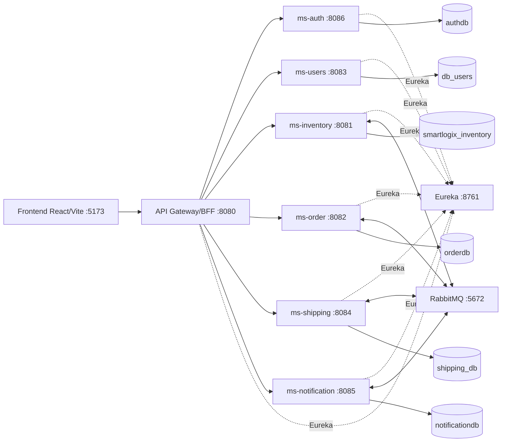

# SmartLogix - Entrega final


---

<!-- Fuente: README_ENTREGA.md -->

# SmartLogix - README de entrega academica

## Nombre del proyecto

SmartLogix.

## Objetivo

Plataforma fullstack de logistica para gestionar autenticacion, usuarios, inventario, ordenes, envios, rutas y notificaciones mediante frontend React, API Gateway/BFF y microservicios Spring Boot.

## Arquitectura

El frontend consume solo el API Gateway/BFF. El Gateway enruta a microservicios registrados en Eureka. Los servicios se integran por REST y eventos RabbitMQ. Cada microservicio persiste en su propia base PostgreSQL.

## Componentes

| Componente | Ruta | Responsabilidad |
|---|---|---|
| Frontend | `Frontend/smartlogix-app` | Interfaz React/Vite/TypeScript |
| API Gateway/BFF | `Backend/api-gateway` | Entrada unica, CORS, JWT, rutas y Swagger |
| Eureka | `Backend/eureka-server` | Service discovery |
| auth | `Backend/auth` | Registro, login y JWT |
| users | `Backend/users` | Empresas, usuarios, roles e integraciones |
| inventory | `Backend/inventory` | Productos, bodegas, stock y reservas |
| order | `Backend/order` | Ordenes y eventos de saga |
| shipping | `Backend/shipping` | Envios, rutas y tracking |
| notification | `Backend/notification` | Notificaciones y correo |

## Tecnologias

Java 21, Spring Boot 3, Spring Cloud Gateway, Eureka, Spring Data JPA, PostgreSQL, RabbitMQ, React, Vite, TypeScript, Vitest, JaCoCo, Docker Compose y Postman.

## Ejecutar frontend

```bash
cd Frontend/smartlogix-app
npm ci
npm run dev
```

URL: `http://localhost:5173`.

## Ejecutar backend

```bash
cd Backend/auth
mvn spring-boot:run
```

Repetir por servicio si se ejecuta manualmente. Para demo completa se recomienda Docker Compose.

## Ejecutar Docker

Todo el sistema:

```bash
docker compose up -d --build
```

Solo backend:

```bash
cd Backend
docker compose -f docker-compose-local.yml up -d --build
```

URLs principales:

- Frontend: `http://localhost:5173`
- Gateway: `http://localhost:8080`
- Swagger Gateway: `http://localhost:8080/swagger-ui.html`
- Eureka: `http://localhost:8761`
- RabbitMQ: `http://localhost:15672`

## Ejecutar pruebas

Backend:

```bash
cd Backend/auth && mvn clean verify
cd ../users && mvn clean verify
cd ../inventory && mvn clean verify
cd ../order && mvn clean verify
cd ../shipping && mvn clean verify
cd ../notification && mvn clean verify
cd ../eureka-server && mvn clean verify
cd ../api-gateway && mvn clean verify
```

Frontend:

```bash
cd Frontend/smartlogix-app
npm run test:coverage
npm run build
```

## Reportes

- JaCoCo backend: `Backend/<servicio>/target/site/jacoco/index.html`.
- Vitest frontend: `Frontend/smartlogix-app/coverage/index.html`.
- Tabla final: `docs/evidencias/04_pruebas_cobertura/cobertura-final.md`.

## Postman

- Collection: `docs/postman/SmartLogix.postman_collection.json`.
- Environment: `docs/postman/SmartLogix.postman_environment.json`.

## Diagramas

- Mermaid: `docs/diagrams/*.mmd`.
- Instrucciones de conversion: `docs/final/README_GENERAR_PDFS.md`.

## PDFs

Fuentes Markdown finales:

- `docs/final/informe-final-smartlogix.md`
- `docs/final/guion-defensa-smartlogix.md`
- `docs/final/README_GENERAR_PDFS.md`

Para generar Markdown compilado, HTML o PDF si `pandoc` esta disponible:

```bash
scripts/generate-docs.ps1
```

o:

```bash
bash scripts/generate-docs.sh
```

## Empaquetado ZIP/RAR

Para preparar un ZIP seguro de entrega:

```powershell
scripts/package-final.ps1
```

o:

```bash
bash scripts/package-final.sh
```

Salida esperada:

```text
dist/SmartLogix_entrega_final.zip
```

El empaquetado excluye `.git`, `.env` reales, `node_modules`, `target`, `dist`, `coverage`, logs y paquetes previos.

## Enlaces GitHub

Ver `repositorios.txt`.

## Seguridad

No incluir `.env` reales, tokens, passwords, claves JWT, credenciales SMTP ni secretos en GitHub ni en el ZIP/RAR. Usar solo `.env.example`.


---

<!-- Fuente: README_TESTS.md -->

# SmartLogix - Guia de Tests Unitarios y Cobertura

Este documento resume frameworks, comandos y metricas reales auditadas desde los reportes existentes. Las cifras corresponden a reportes JaCoCo/Vitest generados por comandos de build y no deben reemplazarse por estimaciones manuales.

## 1. Frameworks

| Componente | Framework | Reporte |
|---|---|---|
| Backend Spring Boot | JUnit 5, Mockito, Spring Boot Test, MockMvc | `Backend/<servicio>/target/site/jacoco/index.html` |
| Frontend React | Vitest, React Testing Library, jsdom | `Frontend/smartlogix-app/coverage/index.html` |

## 2. Comandos backend

Ejecutar por microservicio:

```bash
cd Backend/auth
mvn clean verify
```

Servicios:

```bash
cd Backend/auth && mvn clean verify
cd Backend/users && mvn clean verify
cd Backend/inventory && mvn clean verify
cd Backend/order && mvn clean verify
cd Backend/shipping && mvn clean verify
cd Backend/notification && mvn clean verify
cd Backend/api-gateway && mvn clean verify
cd Backend/eureka-server && mvn clean verify
```

Reporte JaCoCo:

```text
Backend/<servicio>/target/site/jacoco/index.html
Backend/<servicio>/target/site/jacoco/jacoco.xml
```

## 3. Comandos frontend

```bash
cd Frontend/smartlogix-app
npm ci
npm run test
npm run test:coverage
npm run build
```

Reporte Vitest:

```text
Frontend/smartlogix-app/coverage/index.html
Frontend/smartlogix-app/coverage/lcov.info
```

## 4. Tests existentes y reforzados

| Componente | Tests destacados |
|---|---|
| api-gateway | `AuthenticationFilterTest`, `JwtUtilTest`, `RouteValidatorTest` |
| auth | `AuthServiceTest`, `AuthControllerTest`, `JwtUtilTest`, `ChileanRutValidatorTest` |
| inventory | `ProductServiceTest`, `InventoryServiceTest`, `InventoryReservationServiceTest`, `WarehouseServiceTest`, `InventoryMapperTest`, `OrderEventConsumerTest`, controllers |
| order | `OrderServiceTest`, `OrderControllerTest`, `OrderMapperTest`, `OrderEventConsumersTest` |
| shipping | `ShipmentServiceTest`, `RouteServiceTest`, `RoutingApiServiceTest`, `ShippingMapperTest`, `ReservationConfirmedConsumerTest`, `ShippingEventPublisherTest`, controllers |
| notification | `NotificationServiceTest`, `EmailServiceTest`, `OrderEventListenerTest`, `OrderStatusListenersTest`, controller |
| users | tests de `CompanyService`, `UserProfileService`, carriers, integrations, roles, controllers y mappers |
| frontend | servicios API, auth, stores y componentes principales |

## 5. Tests agregados en Prioridad 1

| Servicio | Archivo | Motivo |
|---|---|---|
| auth | `Backend/auth/src/test/java/com/smartlogix/auth_service/exception/GlobalExceptionHandlerTest.java` | Cubrir contrato de errores |
| auth | `Backend/auth/src/test/java/com/smartlogix/auth_service/security/CustomUserDetailsServiceTest.java` | Cubrir carga de usuario Spring Security |
| users | `Backend/users/src/test/java/com/smartlogix/users/exception/GlobalExceptionHandlerTest.java` | Cubrir contrato de errores |
| inventory | `Backend/inventory/src/test/java/com/smartlogix/inventory/exception/GlobalExceptionHandlerTest.java` | Cubrir contrato de errores |
| order | `Backend/order/src/test/java/com/smartlogix/order/exception/GlobalExceptionHandlerTest.java` | Cubrir contrato de errores |
| shipping | `Backend/shipping/src/test/java/com/smartlogix/shipping/exception/GlobalExceptionHandlerTest.java` | Cubrir contrato de errores |
| notification | `Backend/notification/src/test/java/com/smartlogix/notification/exception/GlobalExceptionHandlerTest.java` | Cubrir contrato de errores |

## 6. Tests agregados o reforzados en Fase 2

| Servicio | Archivo | Comportamiento cubierto |
|---|---|---|
| users | `Backend/users/src/test/java/com/smartlogix/users/controller/UsersControllerTest.java` | Controllers principales con MockMvc: companies, profiles, roles, carriers e integrations |
| users | `Backend/users/src/test/java/com/smartlogix/users/mapper/UsersMapperTest.java` | Mapeos entidad/DTO de companies, profiles, carriers e integrations |
| inventory | `Backend/inventory/src/test/java/com/smartlogix/inventory/mapper/InventoryMapperTest.java` | Mappers de products, warehouses, inventory, movements y reservations |
| inventory | `Backend/inventory/src/test/java/com/smartlogix/inventory/service/WarehouseServiceTest.java` | Consultas, creacion, validaciones, actualizacion y baja logica de bodegas |
| inventory | `Backend/inventory/src/test/java/com/smartlogix/inventory/event/OrderEventConsumerTest.java` | Reserva de stock, compensacion y publicacion de eventos RabbitMQ |
| order | `Backend/order/src/test/java/com/smartlogix/order/mapper/OrderMapperTest.java` | Mapeo de orden con comuna, region e items |
| order | `Backend/order/src/test/java/com/smartlogix/order/event/OrderEventConsumersTest.java` | Transiciones por eventos de reserva, despacho y entrega |
| shipping | `Backend/shipping/src/test/java/com/smartlogix/shipping/mapper/ShippingMapperTest.java` | Mapeo de shipment y route, estados y campos anidados |
| shipping | `Backend/shipping/src/test/java/com/smartlogix/shipping/event/ReservationConfirmedConsumerTest.java` | Creacion de envio desde reserva confirmada y errores de repositorio |
| shipping | `Backend/shipping/src/test/java/com/smartlogix/shipping/event/ShippingEventPublisherTest.java` | Publicacion de eventos `order.shipped` y `order.delivered` |
| shipping | `Backend/shipping/src/test/java/com/smartlogix/shipping/service/RoutingApiServiceTest.java` | Fallback local cuando no hay coordenadas o falla el servicio externo |
| notification | `Backend/notification/src/test/java/com/smartlogix/notification/listener/OrderStatusListenersTest.java` | Emails y notificaciones por estados confirmed, shipped, delivered y rejected |
| eureka-server | `Backend/eureka-server/src/test/java/com/smartlogix/eureka/EurekaServerApplicationTest.java` | Bootstrap Spring Boot/Eureka y delegacion de `main` |

## 7. Cobertura real registrada localmente

Metricas leidas desde reportes JaCoCo generados con `mvn clean verify`. El criterio academico se evalua sobre cobertura global de lineas por servicio backend. Antes de entregar, regenerar reportes y usar `docs/evidencias/04_pruebas_cobertura/cobertura-final.md` como tabla final auditada.

| Componente | Lineas antes Fase 2 | Lineas finales | Metodos finales | Ramas finales | Estado frente al 60% | Reporte |
|---|---:|---:|---:|---:|---|---|
| users | 28.83% | 97.46% | 100.00% | 82.14% | Cumple lineas | `Backend/users/target/site/jacoco/index.html` |
| inventory | 33.56% | 87.58% | 84.68% | 67.59% | Cumple lineas | `Backend/inventory/target/site/jacoco/index.html` |
| order | 47.15% | 98.28% | 95.38% | 100.00% | Cumple lineas | `Backend/order/target/site/jacoco/index.html` |
| shipping | 51.83% | 82.44% | 75.00% | 75.96% | Cumple lineas | `Backend/shipping/target/site/jacoco/index.html` |
| notification | 54.11% | 90.78% | 82.81% | 100.00% | Cumple lineas | `Backend/notification/target/site/jacoco/index.html` |
| eureka-server | 0.00% | 66.67% | 50.00% | n/a | Cumple lineas; componente de infraestructura | `Backend/eureka-server/target/site/jacoco/index.html` |
| api-gateway | 66.67% | 87.18% | 100.00% | 70.00% | Cumple lineas | `Backend/api-gateway/target/site/jacoco/index.html` |
| auth | 76.33% | 82.67% | 93.55% | 42.86% | Cumple lineas | `Backend/auth/target/site/jacoco/index.html` |
| frontend | 79.77% | 79.77% | 70.68% | 56.07% | Cumple lineas/funciones | `Frontend/smartlogix-app/coverage/index.html` |

## 8. Observaciones tecnicas

La cobertura de lineas backend funcional queda sobre 60% en todos los servicios revisados e integrados. La cobertura de ramas tambien queda sobre 60% en la mayoria de servicios; `auth` queda bajo 60% en ramas, pero cumple el umbral academico configurado por lineas.

`Backend/eureka-server/pom.xml` ya excluia `**/*Application.class` del check JaCoCo antes de esta fase. Aun asi, se agrego una prueba de bootstrap que valida las anotaciones `@SpringBootApplication`, `@EnableEurekaServer` y la delegacion de `main` hacia `SpringApplication.run`. Eureka debe presentarse como infraestructura de descubrimiento, no como microservicio de negocio.

## 9. Acciones pendientes recomendadas

1. Subir cobertura de ramas en services con reglas de transicion y handlers de errores.
2. Mantener los reportes HTML JaCoCo generados y adjuntarlos como evidencia.
3. Evitar excluir clases adicionales de JaCoCo sin justificacion escrita.
4. Para defensa oral, explicar que el umbral academico se valida sobre lineas globales y que ramas quedan como mejora continua.

## 10. Evidencia recomendada para entrega

Guardar evidencia en `docs/evidencias/04_pruebas_cobertura/`:

- Captura de resumen JaCoCo.
- Captura de `Frontend/smartlogix-app/coverage/index.html`.
- Captura de comando `mvn clean verify`.
- Captura de comando `npm run test:coverage`.

No versionar `target/` ni `coverage/`; ambos estan ignorados y deben usarse solo como fuente para capturas.


---

<!-- Fuente: docs/01-arquitectura.md -->

# Arquitectura SmartLogix

SmartLogix implementa una arquitectura de microservicios para una plataforma logistica fullstack. El frontend React/Vite consume exclusivamente el API Gateway/BFF; los microservicios se registran en Eureka y se integran por REST y eventos RabbitMQ.

## Componentes

| Componente | Ruta | Puerto | Responsabilidad |
|---|---|---:|---|
| Frontend | `Frontend/smartlogix-app` | 5173 | Interfaz React/Vite/TypeScript |
| API Gateway/BFF | `Backend/api-gateway` | 8080 | Entrada unica, CORS, JWT, routing, Swagger agregado |
| Eureka | `Backend/eureka-server` | 8761 | Service discovery |
| ms-auth | `Backend/auth` | 8086 | Registro, login y emision de JWT |
| ms-users | `Backend/users` | 8083 | Empresas, perfiles, roles, carriers e integraciones |
| ms-inventory | `Backend/inventory` | 8081 | Productos, bodegas, stock, movimientos y reservas |
| ms-order | `Backend/order` | 8082 | Ordenes, items y catalogo geografico |
| ms-shipping | `Backend/shipping` | 8084 | Envios, rutas, tracking y estrategia de carrier |
| ms-notification | `Backend/notification` | 8085 | Notificaciones in-app, email y listeners RabbitMQ |

## Diagrama de arquitectura

Fuente Mermaid: `docs/diagrams/arquitectura-microservicios.mmd`.



## BFF/API Gateway

El componente `Backend/api-gateway` cumple el rol de BFF/API Gateway para la entrega:

- Es la unica URL backend consumida por el frontend.
- Expone rutas `/smartlogix/**`.
- Valida JWT en rutas protegidas.
- Propaga `X-Company-Id` al microservicio destino.
- Centraliza CORS.
- Agrega Swagger/OpenAPI de microservicios.

No es un BFF orquestador complejo de vistas; es un Gateway con funciones BFF suficientes para entrada unica, seguridad y contratos REST. Esta decision debe explicarse en defensa oral.

## Integracion

| Tipo | Evidencia |
|---|---|
| Frontend a backend | `Frontend/smartlogix-app/src/services/api.ts` usa `VITE_API_URL` y rutas Gateway |
| Gateway a servicios | `Backend/api-gateway/src/main/resources/application.yml` define rutas `lb://ms-*` |
| Service discovery | Eureka en `Backend/eureka-server` |
| Eventos asincronos | RabbitMQ en order, inventory, shipping y notification |
| Persistencia | PostgreSQL por microservicio en `Backend/docker-compose-local.yml` |

## Patrones defendibles

- MVC: controladores REST por microservicio.
- Service Layer: servicios encapsulan reglas de negocio.
- Repository: Spring Data JPA repositories.
- DTO/Mapper: DTOs y MapStruct en servicios de dominio.
- Dependency Injection: beans Spring y constructor injection.
- API Gateway/BFF: entrada unica para frontend.
- Database per Service: una base PostgreSQL por microservicio.
- Saga coreografiada: order publica eventos, inventory reserva, shipping despacha, notification informa.
- Strategy: `ShippingCalculationStrategy`, `LocalCarrierStrategy`, `DhlStrategy`.
- Circuit Breaker: dependencias externas en shipping/notification.

## Riesgos conocidos

- Los puertos internos de microservicios estan expuestos en Docker Compose para demo local.
- La cobertura global JaCoCo de lineas supera el 60% en los servicios medidos; debe regenerarse antes de entregar para que las capturas coincidan con el estado final.
- No hay migraciones Flyway/Liquibase; se usa JPA/Hibernate con `ddl-auto`.

## Diagramas adicionales

- Despliegue: `docs/diagrams/despliegue.mmd`
- Secuencia principal: `docs/diagrams/secuencia-creacion-orden.mmd`
- Entidad-relacion simplificado: `docs/diagrams/er-simplificado.mmd`


---

<!-- Fuente: docs/02-persistencia.md -->

# Persistencia

La persistencia principal de SmartLogix se implementa con JPA/Hibernate y PostgreSQL por microservicio. No se usa una base monolitica compartida.

## Patron aplicado

SmartLogix aplica Database per Service:

- Cada microservicio tiene su propia base PostgreSQL.
- Las entidades de un servicio no son persistidas por otros servicios.
- La coordinacion entre dominios se realiza por REST y RabbitMQ, no por joins entre bases.

## Bases por servicio

| Servicio | Base | Puerto local | Evidencia |
|---|---|---:|---|
| auth | `authdb` | 5436 | `Backend/auth/src/main/resources/application.yml` |
| users | `db_users` | 5437 | `Backend/users/src/main/resources/application.yml` |
| inventory | `smartlogix_inventory` | 5433 | `Backend/inventory/src/main/resources/application.yml` |
| order | `orderdb` | 5434 | `Backend/order/src/main/resources/application.yml` |
| shipping | `shipping_db` | 5432 | `Backend/shipping/src/main/resources/application.yml` |
| notification | `notificationdb` | 5435 | `Backend/notification/src/main/resources/application.yml` |

Las bases y contenedores estan definidos en `Backend/docker-compose-local.yml`.

## Entidades principales

| Servicio | Entidades |
|---|---|
| auth | `UserCredential` |
| users | `Company`, `UserProfile`, `Role`, `ExternalCarrier`, `MarketplaceIntegration` |
| inventory | `Product`, `Warehouse`, `Inventory`, `InventoryMovement`, `InventoryReservation` |
| order | `Order`, `OrderItem`, `Pais`, `Region`, `Comuna` |
| shipping | `Shipment`, `Route` |
| notification | `Notification` |

## Repositories

Los servicios usan Spring Data JPA repositories en carpetas `repository`, por ejemplo:

- `Backend/inventory/src/main/java/com/smartlogix/inventory/repository`
- `Backend/order/src/main/java/com/smartlogix/order/repository`
- `Backend/users/src/main/java/com/smartlogix/users/repository`

## Datos de inicializacion

`Backend/order/src/main/resources/data.sql` carga datos geograficos de pais, regiones y comunas usados por el frontend al crear ordenes.

## Variables de conexion

| Variable | Uso |
|---|---|
| `DB_URL` | JDBC URL del PostgreSQL del servicio |
| `DB_USERNAME` | Usuario de base |
| `DB_PASSWORD` | Password local o de ambiente |

Las variables reales deben vivir en `.env` locales. Las plantillas seguras son:

- `Backend/.env.example`
- `Backend/users/.env.example`
- `Backend/prisma/.env.example`

## Prisma

`Backend/prisma` es solo una herramienta auxiliar de seed local. No reemplaza JPA ni los repositories Spring del backend.

## Riesgos y mejoras pendientes

- Actualmente no hay Flyway/Liquibase.
- Para produccion se recomienda reemplazar `ddl-auto: update` por migraciones versionadas.
- El diagrama ER simplificado esta en `docs/diagrams/er-simplificado.mmd`.


---

<!-- Fuente: docs/03-pruebas-unitarias.md -->

# Pruebas Unitarias y Cobertura

SmartLogix usa pruebas unitarias y de componentes ligeros en backend y frontend. La meta academica es demostrar al menos 60% de cobertura. En Fase 2 se reforzo cobertura backend con pruebas de controllers, services, mappers, listeners RabbitMQ y bootstrap de infraestructura, sin modificar funcionalidad principal.

## Frameworks

| Capa | Frameworks |
|---|---|
| Backend | JUnit 5, Mockito, Spring Boot Test, MockMvc, JaCoCo |
| Frontend | Vitest, React Testing Library, jsdom, coverage provider `v8` |

## Comandos backend

```bash
cd Backend/auth && mvn clean verify
cd Backend/users && mvn clean verify
cd Backend/inventory && mvn clean verify
cd Backend/order && mvn clean verify
cd Backend/shipping && mvn clean verify
cd Backend/notification && mvn clean verify
cd Backend/api-gateway && mvn clean verify
cd Backend/eureka-server && mvn clean verify
```

Reporte JaCoCo por servicio:

```text
Backend/<servicio>/target/site/jacoco/index.html
Backend/<servicio>/target/site/jacoco/jacoco.xml
```

## Comandos frontend

```bash
cd Frontend/smartlogix-app
npm ci
npm run test:coverage
npm run build
```

Reporte frontend:

```text
Frontend/smartlogix-app/coverage/index.html
Frontend/smartlogix-app/coverage/lcov.info
```

## Cobertura real registrada localmente

| Componente | Lineas antes Fase 2 | Lineas finales | Metodos finales | Ramas finales | Estado frente al 60% |
|---|---:|---:|---:|---:|---|
| users | 28.83% | 97.46% | 100.00% | 82.14% | Cumple en lineas |
| inventory | 33.56% | 87.58% | 84.68% | 67.59% | Cumple en lineas |
| order | 47.15% | 98.28% | 95.38% | 100.00% | Cumple en lineas |
| shipping | 51.83% | 82.44% | 75.00% | 75.96% | Cumple en lineas |
| notification | 54.11% | 90.78% | 82.81% | 100.00% | Cumple en lineas |
| eureka-server | 0.00% | 66.67% | 50.00% | n/a | Cumple en lineas; infraestructura |
| api-gateway | 66.67% | 87.18% | 100.00% | 70.00% | Cumple en lineas |
| auth | 76.33% | 82.67% | 93.55% | 42.86% | Cumple en lineas |
| frontend | 79.77% | 79.77% | 70.68% | 56.07% | Cumple lineas/funciones |

Estas cifras provienen de reportes locales generados por:

- `Backend/*/target/site/jacoco/jacoco.xml`
- `Frontend/smartlogix-app/coverage/lcov.info`

Antes de entregar, ejecutar nuevamente los comandos de validacion y actualizar la tabla final de evidencia en `docs/evidencias/04_pruebas_cobertura/cobertura-final.md` si las cifras cambian.

## Tests agregados en Prioridad 1

Se agregaron pruebas de bajo riesgo para handlers de errores y seguridad:

- `Backend/auth/src/test/java/com/smartlogix/auth_service/exception/GlobalExceptionHandlerTest.java`
- `Backend/auth/src/test/java/com/smartlogix/auth_service/security/CustomUserDetailsServiceTest.java`
- `Backend/users/src/test/java/com/smartlogix/users/exception/GlobalExceptionHandlerTest.java`
- `Backend/inventory/src/test/java/com/smartlogix/inventory/exception/GlobalExceptionHandlerTest.java`
- `Backend/order/src/test/java/com/smartlogix/order/exception/GlobalExceptionHandlerTest.java`
- `Backend/shipping/src/test/java/com/smartlogix/shipping/exception/GlobalExceptionHandlerTest.java`
- `Backend/notification/src/test/java/com/smartlogix/notification/exception/GlobalExceptionHandlerTest.java`

## Tests agregados o reforzados en Fase 2

| Servicio | Archivos principales | Objetivo |
|---|---|
| users | `UsersControllerTest`, `UsersMapperTest` | Cubrir controllers principales y mapeos entidad/DTO |
| inventory | `InventoryMapperTest`, `WarehouseServiceTest`, `OrderEventConsumerTest` | Cubrir mappers, servicio de bodegas y flujo RabbitMQ de reserva/compensacion |
| order | `OrderMapperTest`, `OrderEventConsumersTest` | Cubrir mapeo de orden y transiciones por eventos |
| shipping | `ShippingMapperTest`, `ReservationConfirmedConsumerTest`, `ShippingEventPublisherTest`, `RoutingApiServiceTest` | Cubrir mapeos, creacion de despacho, publicacion RabbitMQ y fallback de rutas |
| notification | `OrderStatusListenersTest` | Cubrir listeners de confirmed, shipped, delivered y rejected |
| eureka-server | `EurekaServerApplicationTest` | Validar anotaciones de bootstrap y delegacion a `SpringApplication.run` |

## Observaciones tecnicas

La cobertura de lineas backend queda sobre 60% en todos los servicios medidos. La cobertura de ramas tambien queda sobre 60% en la mayoria de servicios despues de integrar los tests remotos; `auth` queda bajo 60% en ramas, pero cumple el umbral academico configurado por lineas. Para nota maxima, conviene mantener la evidencia HTML y explicar que Fase 2 priorizo lineas globales y comportamiento de negocio observable.

`eureka-server` es infraestructura de descubrimiento. Su `pom.xml` ya excluia `**/*Application.class` del check JaCoCo antes de esta fase; aun asi, el reporte HTML queda sobre 60% con pruebas de bootstrap. En defensa oral se debe explicar que Eureka no contiene reglas de negocio ni endpoints funcionales del dominio SmartLogix.

## Plan posterior para mejorar calidad de pruebas

1. Aumentar cobertura de ramas en validaciones y transiciones invalidas.
2. Agregar pruebas de integracion controladas para repositorios JPA con H2/Testcontainers si el tiempo lo permite.
3. Separar reporte academico global y thresholds por capa en una configuracion JaCoCo comun.
4. Guardar reportes HTML JaCoCo, capturas de consola y esta documentacion como evidencia de entrega.


---

<!-- Fuente: docs/04-despliegue-y-ejecucion.md -->

# Despliegue y ejecucion

## Requisitos

- Docker y Docker Compose.
- Java 21 para ejecucion local backend.
- Maven para ejecutar tests si no se usa wrapper.
- Node 22 para frontend local.

## Variables de entorno

Plantillas seguras:

- `Backend/.env.example`
- `Backend/users/.env.example`
- `Backend/prisma/.env.example`
- `Frontend/smartlogix-app/.env.example`

No incluir `.env` reales en GitHub ni en el ZIP/RAR final.

## Levantar todo

Desde la raiz:

```bash
docker compose up -d --build
```

Incluye:

- Frontend.
- API Gateway/BFF.
- Eureka.
- Microservicios backend.
- PostgreSQL por servicio.
- RabbitMQ.

## Levantar solo backend

```bash
cd Backend
docker compose -f docker-compose-local.yml up -d --build
```

## URLs

| Recurso | URL |
|---|---|
| Frontend | `http://localhost:5173` |
| API Gateway/BFF | `http://localhost:8080` |
| Swagger Gateway | `http://localhost:8080/swagger-ui.html` |
| Eureka | `http://localhost:8761` |
| RabbitMQ Management | `http://localhost:15672` |

## Validacion Compose

```bash
docker compose config
cd Backend
docker compose -f docker-compose-local.yml config
```

## Detener

```bash
docker compose down
```

Para borrar volumenes locales:

```bash
docker compose down -v
```

`down -v` elimina bases de datos locales.

## CI/CD

La configuracion existe en `.github/workflows/ci.yml` y valida:

- Backend con `mvn -B clean verify`.
- Frontend con `npm ci`, lint, coverage y build.
- Docker Compose config.
- Build Docker.

## Riesgos actuales

- Los microservicios exponen puertos directos para demo local.
- Los Dockerfiles backend construyen imagen con tests omitidos; la calidad se valida por CI y `mvn clean verify`.
- No hay health checks HTTP por Actuator en microservicios.


---

<!-- Fuente: docs/api-endpoints.md -->

# Endpoints API SmartLogix

Todas las rutas se consumen por API Gateway/BFF:

```text
http://localhost:8080
```

Rutas publicas:

- `POST /smartlogix/auth/register`
- `POST /smartlogix/auth/login`
- `/swagger-ui.html`
- `/api-docs/ms-*`

Rutas protegidas:

- `/smartlogix/users/**`
- `/smartlogix/inventory/**`
- `/smartlogix/order/**`
- `/smartlogix/shipping/**`
- `/smartlogix/notification/**`

Para rutas protegidas se usa:

```http
Authorization: Bearer <token>
```

El Gateway valida el JWT y agrega `X-Company-Id` al request enviado al microservicio.

## Auth

| Metodo | Ruta | Body |
|---|---|---|
| `POST` | `/smartlogix/auth/register` | `email`, `password`, `companyName`, `taxId`, `firstName`, `lastName`, `contactEmail`, `phone` |
| `POST` | `/smartlogix/auth/login` | `email`, `password` |

## Users

| Metodo | Ruta | Body/parametros |
|---|---|---|
| `POST` | `/smartlogix/users/companies` | `taxId`, `name`, `contactEmail`, `phone` |
| `GET` | `/smartlogix/users/companies` | - |
| `POST` | `/smartlogix/users/profiles/company/{companyId}/admin` | `authId`, `firstName`, `lastName`, `roles` |
| `POST` | `/smartlogix/users/profiles/company` | `authId`, `firstName`, `lastName`, `roles` |
| `PUT` | `/smartlogix/users/profiles/{profileId}/roles` | array JSON de roles |
| `GET` | `/smartlogix/users/profiles/company` | empresa desde JWT |
| `GET` | `/smartlogix/users/roles` | - |
| `POST` | `/smartlogix/users/carriers/company/{companyId}` | `name`, `contactEmail`, `phone` |
| `GET` | `/smartlogix/users/carriers/company/{companyId}` | - |
| `POST` | `/smartlogix/users/integrations/company/{companyId}` | `platformName`, `webhookSecret`, `active` |
| `GET` | `/smartlogix/users/integrations/company/{companyId}` | - |

## Inventory

| Metodo | Ruta | Body/parametros |
|---|---|---|
| `GET` | `/smartlogix/inventory/products` | - |
| `GET` | `/smartlogix/inventory/products/{id}` | - |
| `GET` | `/smartlogix/inventory/products/sku/{sku}` | - |
| `POST` | `/smartlogix/inventory/products` | `sku`, `name`, `price`, `status` |
| `PUT` | `/smartlogix/inventory/products/{id}` | `sku`, `name`, `price`, `status` |
| `DELETE` | `/smartlogix/inventory/products/{id}` | - |
| `GET` | `/smartlogix/inventory/warehouses` | query opcional `type` |
| `GET` | `/smartlogix/inventory/warehouses/{id}` | - |
| `POST` | `/smartlogix/inventory/warehouses` | `name`, `locationAddress`, `type`, `status` |
| `PUT` | `/smartlogix/inventory/warehouses/{id}` | `name`, `locationAddress`, `type`, `status` |
| `DELETE` | `/smartlogix/inventory/warehouses/{id}` | - |
| `GET` | `/smartlogix/inventory/stocks` | query opcional `productId`, `warehouseId` |
| `GET` | `/smartlogix/inventory/stocks/{id}` | - |
| `POST` | `/smartlogix/inventory/stocks` | `productId`, `warehouseId`, `stockAvailable` |
| `PATCH` | `/smartlogix/inventory/stocks/{id}/increase` | `quantity`, `reason` |
| `PATCH` | `/smartlogix/inventory/stocks/{id}/decrease` | `quantity`, `reason` |
| `GET` | `/smartlogix/inventory/stocks/{id}/movements` | - |
| `GET` | `/smartlogix/inventory/reservations` | query opcional `orderId`, `status` |
| `GET` | `/smartlogix/inventory/reservations/{id}` | - |
| `POST` | `/smartlogix/inventory/reservations` | `orderId`, `productId`, `warehouseId`, `quantity`, `companyId` |
| `PATCH` | `/smartlogix/inventory/reservations/{id}/compensate` | - |
| `PATCH` | `/smartlogix/inventory/reservations/{id}/confirm-output` | - |

## Order

| Metodo | Ruta | Body/parametros |
|---|---|---|
| `POST` | `/smartlogix/order/orders` | `customerName`, `customerEmail`, `street`, `comunaId`, `items` |
| `GET` | `/smartlogix/order/orders` | - |
| `GET` | `/smartlogix/order/orders/{id}` | - |
| `PUT` | `/smartlogix/order/orders/{id}/status` | `{ "status": "CONFIRMED" }` |
| `GET` | `/smartlogix/order/regiones` | - |
| `GET` | `/smartlogix/order/comunas?regionId=13` | query `regionId` |

## Shipping

| Metodo | Ruta | Body/parametros |
|---|---|---|
| `GET` | `/smartlogix/shipping/shipments` | query opcional `deliveryStatus` |
| `GET` | `/smartlogix/shipping/shipments/{id}` | - |
| `GET` | `/smartlogix/shipping/shipments/tracking/{tracking_number}` | - |
| `POST` | `/smartlogix/shipping/shipments` | `orderId`, `customerName`, `customerEmail`, `shippingAddress`, `latitude`, `longitude`, `deliveryStatus` |
| `PATCH` | `/smartlogix/shipping/shipments/{id}/status` | JSON string, por ejemplo `"DISPATCHED"` |
| `DELETE` | `/smartlogix/shipping/shipments/{id}` | - |
| `GET` | `/smartlogix/shipping/routes` | query opcional `status` |
| `POST` | `/smartlogix/shipping/routes` | `carrierId`, `originAddress`, `shipmentIds`, `optimizeRoute` |
| `POST` | `/smartlogix/shipping/routes/generate-proposal` | `originAddress`, `shipmentIds` |
| `GET` | `/smartlogix/shipping/routes/{id}` | - |
| `PATCH` | `/smartlogix/shipping/routes/{id}/status` | JSON string, por ejemplo `"IN_PROGRESS"` |
| `DELETE` | `/smartlogix/shipping/routes/{id}` | - |

## Notification

| Metodo | Ruta | Body/parametros |
|---|---|---|
| `POST` | `/smartlogix/notification/notifications` | `orderId`, `recipient`, `subject`, `message` |
| `GET` | `/smartlogix/notification/notifications` | - |
| `GET` | `/smartlogix/notification/notifications/unread` | - |
| `PATCH` | `/smartlogix/notification/notifications/{id}/read` | - |
| `GET` | `/smartlogix/notification/notifications/{id}` | - |
| `GET` | `/smartlogix/notification/notifications/order/{orderId}` | - |

## Postman

- Coleccion: `docs/postman/SmartLogix.postman_collection.json`
- Environment: `docs/postman/SmartLogix.postman_environment.json`

El request de login guarda `token` y `companyId` en el environment si la respuesta es exitosa.


---

<!-- Fuente: docs/demo-guion-funcional.md -->

# Guion de demo funcional SmartLogix

## 1. Levantar infraestructura

- Objetivo: iniciar bases PostgreSQL, RabbitMQ, Eureka, Gateway y microservicios.
- URL local: no aplica.
- Comando: `docker compose up -d --build`.
- Que debe observar el docente: contenedores iniciados sin errores criticos.
- Que decir: "La demo usa Docker Compose para reproducir la infraestructura completa con una base por servicio y RabbitMQ para eventos."

## 2. Abrir Eureka

- Objetivo: demostrar service discovery.
- URL local: `http://localhost:8761`.
- Comando: no aplica si Docker ya esta levantado.
- Que debe observar el docente: servicios `ms-auth`, `ms-users`, `ms-inventory`, `ms-order`, `ms-shipping`, `ms-notification` y `api-gateway`.
- Que decir: "Eureka permite que el Gateway resuelva servicios por nombre logico en vez de depender de URLs fijas."

## 3. Abrir Gateway Swagger

- Objetivo: mostrar contratos OpenAPI agregados desde el Gateway.
- URL local: `http://localhost:8080/swagger-ui.html`.
- Comando: no aplica.
- Que debe observar el docente: selector con APIs `ms-*`.
- Que decir: "El frontend y Postman consumen el Gateway; Swagger centraliza la documentacion tecnica de los servicios."

## 4. Abrir frontend

- Objetivo: mostrar la interfaz React.
- URL local: `http://localhost:5173`.
- Comando local alternativo: `cd Frontend/smartlogix-app && npm run dev`.
- Que debe observar el docente: aplicacion cargada y conectada al Gateway.
- Que decir: "El frontend usa `VITE_API_URL` para enviar todas las llamadas a `http://localhost:8080`."

## 5. Login

- Objetivo: obtener sesion y JWT.
- URL local: `http://localhost:5173`.
- Comando: no aplica.
- Que debe observar el docente: login exitoso y acceso a pantalla principal.
- Que decir: "El servicio auth emite JWT y el Gateway protege rutas de negocio con Bearer token."

## 6. Mostrar dashboard o pantalla principal

- Objetivo: evidenciar navegacion funcional.
- URL local: `http://localhost:5173`.
- Comando: no aplica.
- Que debe observar el docente: opciones operativas para ordenes, inventario, envios o rutas.
- Que decir: "La pantalla principal permite operar el flujo logistico desde una sola interfaz."

## 7. Crear o consultar orden

- Objetivo: demostrar el flujo principal del dominio.
- URL local: frontend o `http://localhost:8080/smartlogix/order/orders`.
- Comando Postman opcional: `POST /smartlogix/order/orders`.
- Que debe observar el docente: orden creada o listado de ordenes.
- Que decir: "Order persiste la orden y publica eventos para continuar la saga de reserva y despacho."

## 8. Mostrar impacto en inventario

- Objetivo: evidenciar reserva o consulta de stock.
- URL local: `http://localhost:8080/smartlogix/inventory/stocks`.
- Comando Postman opcional: `GET /smartlogix/inventory/stocks`.
- Que debe observar el docente: stock, reserva o movimiento asociado.
- Que decir: "Inventory gestiona stock y reservas; no comparte tablas con order, se coordina por eventos."

## 9. Mostrar flujo shipping

- Objetivo: mostrar despacho, tracking o rutas.
- URL local: `http://localhost:8080/smartlogix/shipping/shipments`.
- Comando Postman opcional: `GET /smartlogix/shipping/shipments`.
- Que debe observar el docente: shipment, tracking o ruta generada.
- Que decir: "Shipping aplica estrategia de carrier y usa circuit breaker/fallback para ruteo externo."

## 10. Mostrar notificacion

- Objetivo: demostrar feedback al cliente o usuario.
- URL local: `http://localhost:8080/smartlogix/notification/notifications`.
- Comando Postman opcional: `GET /smartlogix/notification/notifications`.
- Que debe observar el docente: notificaciones persistidas o correo preparado.
- Que decir: "Notification escucha eventos de orden y despacho para informar cambios de estado."

## 11. Mostrar Postman

- Objetivo: demostrar pruebas manuales reproducibles de API.
- URL local: no aplica.
- Comando: importar `docs/postman/SmartLogix.postman_collection.json` y environment.
- Que debe observar el docente: login, token guardado, requests protegidos y casos 400/404.
- Que decir: "Postman deja una evidencia independiente del frontend para validar contratos REST."

## 12. Mostrar reportes de cobertura

- Objetivo: evidenciar pruebas automatizadas.
- URL local: abrir archivos HTML locales.
- Comando: `mvn clean verify` por servicio y `npm run test:coverage`.
- Que debe observar el docente: reportes JaCoCo y Vitest coverage.
- Que decir: "La cobertura se mide por servicio; los reportes generados no se versionan porque `target/` y `coverage/` estan ignorados."

## 13. Explicar arquitectura

- Objetivo: conectar componentes y responsabilidades.
- URL local: no aplica.
- Comando: abrir `docs/01-arquitectura.md`.
- Que debe observar el docente: diagrama de arquitectura.
- Que decir: "SmartLogix separa dominios en microservicios y usa Gateway, Eureka y RabbitMQ para integracion."

## 14. Explicar persistencia

- Objetivo: defender Database per Service.
- URL local: no aplica.
- Comando: abrir `docs/02-persistencia.md`.
- Que debe observar el docente: tabla de bases y entidades JPA.
- Que decir: "Cada servicio tiene su propia base PostgreSQL y sus repositories JPA; no hay base monolitica compartida."

## 15. Explicar pruebas

- Objetivo: cerrar con calidad y riesgos.
- URL local: no aplica.
- Comando: abrir `README_TESTS.md` y `docs/evidencias/04_pruebas_cobertura/cobertura-final.md`.
- Que debe observar el docente: tabla de cobertura, rutas de reportes y comandos.
- Que decir: "Las pruebas cubren services, controllers, mappers, listeners y componentes frontend; las mejoras pendientes estan documentadas."


---

<!-- Fuente: docs/guia-defensa-oral.md -->

# Guia de defensa oral SmartLogix

## Discurso tecnico recomendado

SmartLogix se organiza como una arquitectura de microservicios porque el dominio logistico se divide en responsabilidades independientes: autenticacion, usuarios, inventario, ordenes, despacho y notificaciones. El frontend consume solo el API Gateway/BFF, que centraliza seguridad, CORS, rutas y documentacion OpenAPI. Cada microservicio persiste sus datos con JPA en una base PostgreSQL propia y se integra con otros servicios mediante REST y eventos RabbitMQ.

## Preguntas probables y respuestas

### Por que microservicios?

Porque el sistema tiene dominios funcionales independientes. Separar auth, users, inventory, order, shipping y notification reduce acoplamiento, permite escalar servicios criticos y mejora la mantenibilidad.

### Donde esta el BFF?

Esta en `Backend/api-gateway`. Es un BFF/API Gateway: el frontend consume una sola entrada HTTP, el Gateway valida JWT, aplica CORS, enruta a microservicios y agrega Swagger. No es un BFF con agregaciones complejas de vista, pero cumple el rol de frontera backend para frontend.

### Como se comunica el frontend con backend?

El frontend centraliza llamadas en `Frontend/smartlogix-app/src/services/api.ts` y usa `VITE_API_URL`. Las rutas apuntan al Gateway en `http://localhost:8080/smartlogix/...`.

### Como se comunican los microservicios?

Por REST para solicitudes directas y RabbitMQ para eventos del flujo principal. Al crear una orden, order publica evento, inventory reserva stock, shipping crea envio/ruta y notification informa al cliente.

### Como funciona la persistencia?

Cada microservicio tiene JPA/Hibernate y PostgreSQL propio. Esto aplica Database per Service. El servicio order ademas carga regiones y comunas desde `Backend/order/src/main/resources/data.sql`.

### Como se mide cobertura?

Backend usa JaCoCo por microservicio. Frontend usa Vitest coverage v8. Los reportes estan en `target/site/jacoco/index.html` y `Frontend/smartlogix-app/coverage/index.html`.

### Que patrones aplicaron realmente?

MVC, Repository, Service Layer, DTO/Mapper, Dependency Injection, API Gateway/BFF, Database per Service, Saga coreografiada con RabbitMQ, Strategy en shipping y Circuit Breaker en integraciones externas.

### Cual es la principal limitacion actual?

La cobertura global de lineas supera el 60% en los servicios medidos, pero quedan mejoras productivas: migraciones Flyway/Liquibase, Actuator health checks, observabilidad centralizada y seguridad interna entre microservicios si se despliega fuera de un entorno local controlado.

### Como se ejecuta el sistema?

Con Docker Compose desde la raiz:

```bash
docker compose up -d --build
```

Luego se revisa frontend en `http://localhost:5173`, Gateway en `http://localhost:8080`, Swagger en `/swagger-ui.html` y Eureka en `http://localhost:8761`.

## Checklist antes de exponer

- [ ] Ejecutar Postman login y guardar token.
- [ ] Mostrar Swagger Gateway.
- [ ] Mostrar diagrama arquitectura.
- [ ] Explicar flujo de orden.
- [ ] Mostrar JPA repositories y entidades.
- [ ] Mostrar tests y cobertura.
- [ ] Mostrar cobertura regenerada y explicar brechas de ramas donde existan.
- [ ] Explicar plan de mejora.


---

<!-- Fuente: docs/final/informe-final-smartlogix.md -->

# SmartLogix - Informe final

## Resumen ejecutivo

SmartLogix es una plataforma fullstack de logistica orientada a gestion de usuarios, empresas, productos, inventario, ordenes, rutas, envios y notificaciones. La solucion combina frontend React/Vite, API Gateway/BFF, microservicios Spring Boot, PostgreSQL por servicio y mensajeria RabbitMQ.

## Objetivo del sistema

El objetivo es centralizar el flujo logistico principal de una orden:

1. Registrar o autenticar usuarios.
2. Crear empresas, perfiles y roles.
3. Administrar productos, bodegas e inventario.
4. Crear ordenes con items y destino geografico.
5. Reservar stock.
6. Generar envio y ruta.
7. Notificar cambios de estado.

## Arquitectura

La arquitectura se separa por dominios funcionales:

| Capa | Componente | Responsabilidad |
|---|---|---|
| Presentacion | `Frontend/smartlogix-app` | Interfaz React/Vite/TypeScript |
| Entrada backend | `Backend/api-gateway` | Gateway/BFF, CORS, JWT, rutas y Swagger |
| Discovery | `Backend/eureka-server` | Registro y descubrimiento de servicios |
| Dominio | `auth`, `users`, `inventory`, `order`, `shipping`, `notification` | Reglas de negocio por contexto |
| Infraestructura | PostgreSQL y RabbitMQ | Persistencia y eventos asincronos |

El frontend consume solo el API Gateway. El Gateway enruta a servicios registrados en Eureka mediante rutas `lb://ms-*`. La comunicacion sincronica se usa para operaciones REST y la asincronica para el flujo de ordenes, reservas, envios y notificaciones.

## Patrones aplicados

- API Gateway/BFF como entrada unica para frontend.
- MVC en controladores REST.
- Service Layer para reglas de negocio.
- Repository con Spring Data JPA.
- DTO/Mapper para contratos de entrada y salida.
- Database per Service para independencia de datos.
- Saga coreografiada con eventos RabbitMQ.
- Strategy en calculo de envios.

## Persistencia

Cada microservicio tiene su propia base PostgreSQL:

| Servicio | Base |
|---|---|
| auth | `authdb` |
| users | `db_users` |
| inventory | `smartlogix_inventory` |
| order | `orderdb` |
| shipping | `shipping_db` |
| notification | `notificationdb` |

Las entidades principales estan en paquetes `model` y se acceden mediante repositories JPA. El servicio `order` incluye `data.sql` para datos geograficos de pais, regiones y comunas.

## API REST y contratos

La evidencia de endpoints esta en:

- `docs/api-endpoints.md`
- `docs/postman/SmartLogix.postman_collection.json`
- `docs/postman/SmartLogix.postman_environment.json`

El Gateway expone Swagger/OpenAPI agregado desde `http://localhost:8080/swagger-ui.html`.

## Flujo principal

1. El usuario crea una orden desde el frontend.
2. El frontend envia la solicitud al Gateway.
3. El Gateway enruta hacia `order`.
4. `order` guarda la orden y publica el evento de creacion.
5. `inventory` reserva stock y publica confirmacion o rechazo.
6. `shipping` genera envio/ruta cuando hay reserva confirmada.
7. `notification` registra y envia notificaciones por estado.

## Pruebas y cobertura

La estrategia de pruebas cubre servicios, controllers, mappers, listeners/eventos, seguridad y frontend.

Backend:

```bash
mvn clean verify
```

Frontend:

```bash
npm run test:coverage
npm run build
```

La tabla auditada esta en `docs/evidencias/04_pruebas_cobertura/cobertura-final.md`. La cobertura global de lineas registrada supera el 60% en los servicios medidos.

## Despliegue

La demo local se ejecuta con Docker Compose:

```bash
docker compose up -d --build
```

URLs principales:

| Recurso | URL |
|---|---|
| Frontend | `http://localhost:5173` |
| API Gateway | `http://localhost:8080` |
| Swagger | `http://localhost:8080/swagger-ui.html` |
| Eureka | `http://localhost:8761` |
| RabbitMQ | `http://localhost:15672` |

## Seguridad de entrega

El ZIP/RAR final no debe incluir `.env` reales, tokens, passwords, claves JWT, credenciales SMTP, `target`, `coverage`, `dist`, `node_modules`, `.git` ni logs. Solo deben incluirse plantillas `.env.example`.

## Riesgos y mejoras

- Reemplazar `ddl-auto` por migraciones Flyway/Liquibase en produccion.
- Agregar health checks HTTP por servicio con Actuator.
- Endurecer seguridad interna entre microservicios fuera de entorno local.
- Mejorar observabilidad centralizada.
- Subir cobertura de ramas donde sea necesario para una metrica mas estricta.

## Conclusion

SmartLogix cumple con una entrega fullstack basada en microservicios, persistencia independiente por servicio, integracion REST/eventos, gateway centralizado, pruebas automatizadas y documentacion operativa. La solucion es defendible academicamente porque conecta arquitectura, implementacion, pruebas y despliegue con evidencias concretas del repositorio.


---

<!-- Fuente: docs/final/guion-defensa-smartlogix.md -->

# SmartLogix - Guion de defensa oral

## Apertura

SmartLogix es una plataforma fullstack de logistica. Permite gestionar usuarios, empresas, productos, inventario, ordenes, envios, rutas y notificaciones. El sistema se construyo con frontend React, API Gateway/BFF y microservicios Spring Boot.

## 1. Arquitectura

El frontend no llama directamente a los microservicios. Todas las solicitudes pasan por `Backend/api-gateway`, que centraliza rutas, CORS, JWT y Swagger.

Los microservicios se registran en Eureka:

- auth
- users
- inventory
- order
- shipping
- notification

La separacion permite mantener dominios independientes y escalar servicios de forma aislada.

## 2. Persistencia

Se aplica Database per Service. Cada servicio tiene su propia base PostgreSQL y sus propias entidades JPA.

Esto evita acoplamiento por base compartida. Cuando un servicio necesita coordinarse con otro, usa REST o eventos RabbitMQ.

## 3. Flujo principal

El flujo mas importante es la creacion de una orden:

1. El usuario crea la orden desde React.
2. El Gateway enruta la solicitud a `order`.
3. `order` guarda la orden y publica un evento.
4. `inventory` intenta reservar stock.
5. Si hay stock, se publica reserva confirmada.
6. `shipping` crea envio y ruta.
7. `notification` registra y envia notificaciones.

Este flujo muestra integracion sincronica y asincronica.

## 4. Seguridad

`auth` emite JWT. El Gateway valida el token en rutas protegidas y propaga informacion como `X-Company-Id` hacia los servicios.

Para la entrega se incluyen solo `.env.example`. Los `.env` reales no deben subirse ni empaquetarse.

## 5. Pruebas

Backend usa JUnit 5, Mockito, Spring Boot Test, MockMvc y JaCoCo. Frontend usa Vitest, Testing Library y coverage V8.

La cobertura global de lineas queda sobre 60% en los servicios medidos. La tabla final esta en `docs/evidencias/04_pruebas_cobertura/cobertura-final.md`.

## 6. Despliegue

Docker Compose levanta frontend, gateway, Eureka, microservicios, PostgreSQL por servicio y RabbitMQ.

Comando principal:

```bash
docker compose up -d --build
```

URLs para demo:

- Frontend: `http://localhost:5173`
- Gateway: `http://localhost:8080`
- Swagger: `http://localhost:8080/swagger-ui.html`
- Eureka: `http://localhost:8761`
- RabbitMQ: `http://localhost:15672`

## Preguntas frecuentes

### Por que microservicios

Porque el dominio logistico esta dividido en responsabilidades independientes. Esto reduce acoplamiento y permite evolucionar servicios por separado.

### Por que API Gateway/BFF

Porque simplifica el frontend, centraliza seguridad, CORS, rutas y documentacion Swagger.

### Por que RabbitMQ

Porque el flujo de ordenes requiere coordinar reservas, envios y notificaciones sin acoplar servicios con llamadas sincronicas en cadena.

### Por que JPA

Porque integra entidades, repositories y transacciones con Spring Boot, reduciendo boilerplate.

### Que falta para produccion

Migraciones versionadas, health checks, observabilidad centralizada y seguridad interna mas estricta entre microservicios.

## Cierre

SmartLogix demuestra una arquitectura fullstack completa: frontend funcional, gateway, microservicios, persistencia por servicio, eventos, pruebas, cobertura y despliegue reproducible.

